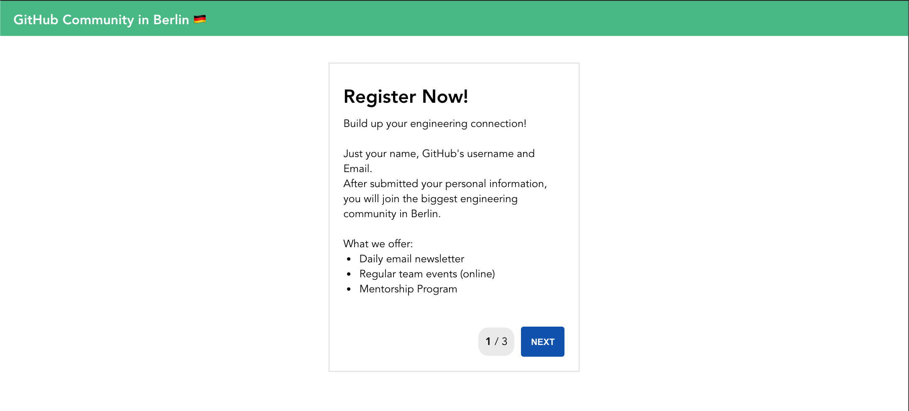
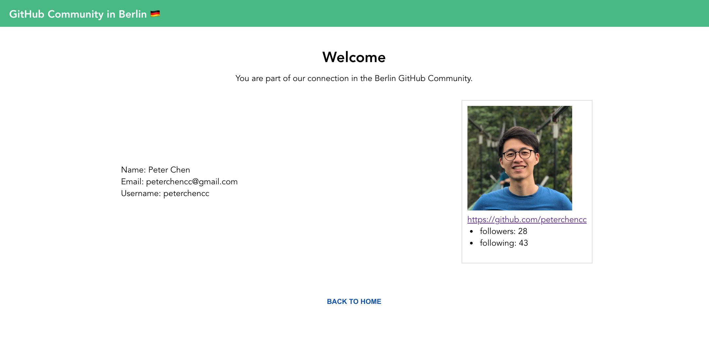

# multi-step form app

[](https://app.netlify.com/sites/vue-multi-steps/deploys)

This is a simple app that guides a user through a multi-step process to register into a community group.

By filling up the form step-by-step, you will get more information from Github APIs at the end.




## Technologies

- Vue.js 3
- Vuex 4
- [vee-validate 4](https://vee-validate.logaretm.com/v4/) with [yup](https://github.com/jquense/yup)
- Axios
- Jest

## Project setup

To run this project, use the following commands in your terminal:

```
# clone the repository
git clone git@github.com:peterchencc/vue-multi-steps.git

# change the folder
cd vue-multi-steps

# install dependencies
npm install

# Compiles and hot-reloads for development
npm run serve

# Compiles and minifies for production
npm run build

# Run unit tests
npm run test:unit
```

## Project structure

The home page contain two part, `<Form>` wrapper and `<UserDetail>` component. vee-validate offers many helpers to handle form validation. Using `<Form>` wrapper with `handleSubmit` slot to handle form submissions manually by clicking "next" button and trigger a callback to next step.

Switch between each steps by dynamic components. Every step with required input field `<Field> <ErrorMessage>` to handle errors and basic validation. The method `validateCurrentStep` will check the values and errors on current step. If the value on the current step is invalid, the "Next" button will be disabled.

The `<UserDetail>` component shows up only when user finish the steps and submit the from. It will fetch the GitHub API with username to get response data and show the avatar image.

## Gotchas

### Add HTML `autofocus` attribute on the first text field

Let the first input field automatically get focus when the component loads

### Use CSS `order` property to specify the order of "Back" "Next" button position

Placing the "Next" button follows the last input field in the HTML. User can press "Tab" after filling each of the field. It will then focus on "Next" button after last field.

```html
<form>
  <input text="text" name="lastname" />
  <input text="text" name="username" />
</form>
<div class="step-footer">
  <div class="current-steps">2 / 3</div>
  <!-- order: 2; -->
  <button type="button" class="btn-next">Next</button>
  <!-- order: 3; -->
  <button type="button" class="btn-back">Back</button>
  <!-- order: 1; -->
</div>
```

On the app.


Small change on the HTML structure and keep the UI with more intuitive UX.

### Use CSS Grid in `<UserDetail>` component to display responsive layout

### Bonus: workflow can be browsed using the native browser's "back" / "next" buttons

Approach: Using Vue Router. By declaring every step path, so that we can use Web API History `back()` / `forward()` to trigger native browser.

```js
{
  path: '/steps',
  component: Steps,
  children: [
    { path: '1', component: StepOne, name: 'StepOne' },
    { path: '2', component: StepTwo, name: 'StepTwo' },
    { path: '3', component: StepThree, name: 'StepThree' }
  ],
},
```

I tried this way at the beginning and found out we need to add some complex logic on navigation guards and redirection on `$router`. Too much criteria, and I'm new for the Vue Router. So I decided to build a simple one that can finish our goal first.

### Bonus: Animate workflow transitions

I tried to add this kind of transition on the dynamic components. So it could have animation when switching between each workflow.

```html
<transition name="component-fade" mode="out-in">
  <component :is="component"></component>
</transition>
```

But it didn't work out at the end. Not sure what happened here. I've done the same way under Vue.js 2 before and it worked.

### What can improved?

- Refactor the `<FormOne>` `<FormTwo>`, wrap a reusable `<form-input>` component for them.
- Improve the error handling of fetching GitHub API.
- With or without Vuex for this project?
- More testing
